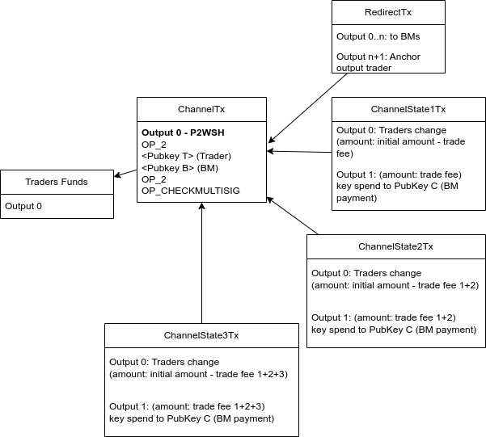

# trade fee payment on chain

## requirements

- one channel per user
- channel directly to contributor (otherwise too many on-chain fees)
- creating a channel is no requirement.
- channel capacity is limited to DPT-like-amounts or less.
- one channel with one contributor
- contributor must not be online when creating the channel
- contributor must not be online when a channel is used.
- trader should be able to close the channel (even if BM is unresponsive).
- no address reuse on the trader or contributor side.

## unidrectional channels



### opening

Trader broadcast a transaction to a multisig, between the trader and a BM (ChannelTx).
If the trade shall be
able to initiate the channel without communicating with the BM, the trader will not be able to
do the multisig using MuSig2. Instead, he will need to use a taproot-script. For the script he
needs to have a public key of the BM. This could be provided using a silent payment, see [BIP-352](https://github.com/bitcoin/bips/blob/master/bip-0352.mediawiki).
When opening the channel, the trade has to decide which capacity the channel gets. The channel size
has a limit.

### usage

With each trade this trader does, he can use the trade channel to pay the trade fees. To do so,
he will create a transaction from the channel multisig to an address of the BM (get address
using silent payment). Then he presigns the transaction with his key. Since it's a multisig, his
key is not enough, but the BM can complete it at any time. For each trade fee the trader signs
another transaction, the amount must be the amount of the last transaction plus the fee.

### verification of the channel from second trader

The first trader will send the second trader the following message:

1. channel opening TxId.
2. channel update transaction (this is the payment of the fees)
3. channel RedirectTx (see below)
4. random value generated by the second trader (second trader needs to send this first)
5. Signature of 1,2 and 3 to be verified with the pubkey key used in 1. (Schnorr Signature)

The second trader verifies the message by:

1. channel opening transaction exists on blockchain, and the second party in the channel is the
   BM (TODO How??)
2. verify channel update transaction
    1. is signed correctly by the first trader
    2. the amount is correct
    3. the beneficiary is the BM (TODO How??)
3. channel opening transaction capacity isn't exceeded
4. channel RedirectTx is partially signed by the first trader and sends funds to all BMs
5. the random value is correct.
6. Signature verification

He does not verify the rest, especially not against previous transaction and double spend. The second
trader encrypts that message and sends it to the bisq network
for everyone to receive. Among everyone is the BM, the receiver. The BM does not need to be online
and can verify his part at any later point in time.

After verification, the second trader will encrypt the message from the first trader with the BMs pubkey
and send it to the message box of the BM.

### verification from BM

Whenever the BM comes online, he will collect all messages and tries to decrypt them. He can
decrypt all messages to him. From those messages he learns which channel-opening Txids are for
him. He verifies all messages with the same Txid and checks if the channel update transactions are
correct and the amounts add up properly. If not, he signs and broadcasts the RedirectTx, which
will send all funds to the DAO for arbitration. The second trader has posted the channel update
transactions which he validated. So if they don't add up, or there are too many transactions, the
arbitrator can decide if there was a fraud going on.
Note that the bisq-software can make the decision of the BM and the arbitrator automatically.

### close of the channel by BM

In the happy path the BM will close the channel when the time is up (anywhere before $t_1$ expires)
or the BM is asked to close the channel by the trader.
After verification, he will issue the latest channel state transaction and that ends this protocol.

### close of the channel by trader

A channel expires after some time (maybe a month?). This is in case the BM is inactive and the
trader wants the rest of the funds back. For this the trader can use the ChannelTx output0 with
script spend2, which has the bitcoin script:

``` 
<relative time t1>
OP_CSV
OP_DROP
<Trader Pubkey>
OP_CHECKSIG
```

The trader can send the funds to his wallet, effectively punishing the BM for not responding.
